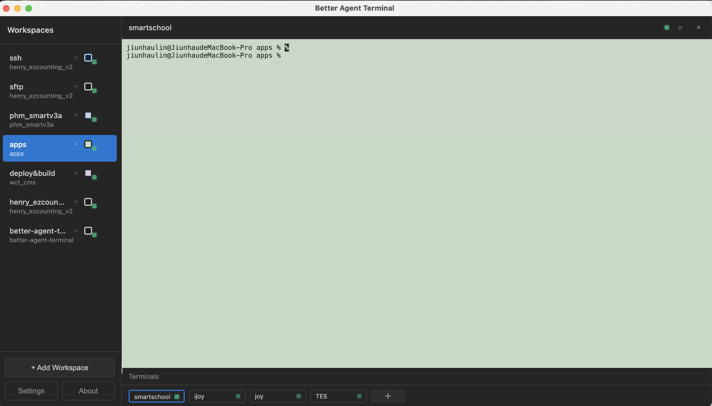

# Better Agent Terminal (Peter's Fork)

<div align="center">


**A terminal aggregator with multi-workspace support and Claude Code integration**

Forked from [TonyQ's better-agent-terminal](https://github.com/tony1223/better-agent-terminal)

</div>

---

## Screenshot

<div align="center">

</div>

---

## New Features (Peter's Branch)

### Workspace & Terminal Management
- **Drag & Drop Workspace/Terminal Reordering** - Drag to reorder workspaces and terminal tabs
- **Workspace Folder Drop** - Drop folder to create new workspace
- **Terminal Rename** - Double-click to rename terminal tabs
- **Workspace Delete Confirmation** - Confirm dialog before deleting workspace
- **Remember Active Terminal** - Switching workspace remembers last focused terminal
- **Auto-focus Terminal** - Terminal automatically gets keyboard focus when switching workspaces

### Terminal Improvements
- **Per-Workspace Shell History** - Each workspace maintains its own `.terminal_history`
- **Login Shell Support** - Loads `~/.zshrc` / `~/.bashrc` on startup
- **Terminal State Preservation** - All workspaces stay mounted, terminals keep running when switching
- **Persistent Terminals** - Terminal sessions persist across app restarts
- **Terminal Font Size Fix** - Fixed font size setting not applying
- **Readline Navigation on Mac** - Ctrl+F/Ctrl+B work in SSH for cursor movement (Cmd+F for search)

### UI Enhancements
- **4 New Soft Terminal Themes** - Additional color themes for terminals
- **Workspace Color Badges** - Custom color indicators for each workspace
- **Improved Workspace UI** - Better visual design

---

## Original Features

- **Multi-Workspace Support** - Organize terminals by project folders
- **Google Meet-Style UI** - Main panel + thumbnail bar layout
- **Claude Code Integration** - Dedicated terminal for AI pair programming
- **Easy Copy/Paste** - Ctrl+Shift+C/V or right-click
- **Terminal Restart** - Preserves working directory
- **UTF-8 Support** - Full Unicode/Chinese character support
- **PowerShell Ready** - Automatic ExecutionPolicy Bypass

---

## Quick Start

```bash
# Clone the repository
git clone https://github.com/nicepeter/better-agent-terminal.git
cd better-agent-terminal
git checkout peter

# Install dependencies
npm install

# Rebuild node-pty for Electron
npx @electron/rebuild -f -w node-pty

# Development mode
npm run dev

# Build for production
npm run build
```

---

## License

MIT License - see [LICENSE](LICENSE) for details.

---

## Credits

- Original author: **TonyQ** - [@tony1223](https://github.com/tony1223)
- This fork: **Peter** - [@nicepeter](https://github.com/nicepeter)

Built with assistance from Claude Code
